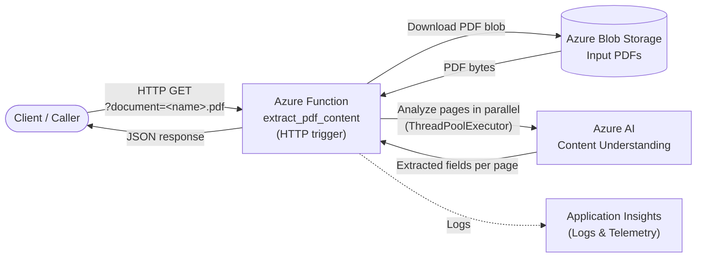

# Azure Content Understanding Function

## Overview
This Azure Functions app provides the `extract_pdf_content` HTTP endpoint implemented in `function_app.py`, which downloads a PDF from Azure Blob Storage and uses Azure AI Content Understanding to extract field data per page, returning the results as JSON.

Key features:
- Managed identity authentication via `DefaultAzureCredential`.
- Blob retrieval using `BlobServiceClient` (configurable account/container).
- PDF splitting into single-page byte streams via `PyPDF2`.
- Parallel page analysis using `ThreadPoolExecutor` for improved throughput.
- Field extraction per page, with a best-effort `TotalTaxesDue` value that falls back to `TotalDueWithDiscount` or `TaxAfterDiscount`.

## Architecture



## Prerequisites
- Python 3.10+
- Azure Functions Core Tools (for local development)
- Azure Storage account containing the PDFs
- Azure AI Content Understanding endpoint and analyzer (default `prebuilt-documentFields`)

## Configuration
Set the following environment variables (or add them to `local.settings.json` for local runs):

| Setting | Description |
| --- | --- |
| `BLOB_ACCOUNT_URL` | Blob storage endpoint, e.g., `https://<account>.blob.core.windows.net`. |
| `BLOB_CONTAINER_NAME` | Storage container containing PDFs (default `documents`). |
| `CONTENT_UNDERSTANDING_ENDPOINT` | Azure AI Content Understanding endpoint. |
| `CONTENT_UNDERSTANDING_ANALYZER` | Analyzer ID (default `prebuilt-documentFields`). |
| `MANAGED_IDENTITY_CLIENT_ID` | Optional user-assigned managed identity client ID for DefaultAzureCredential. |
| `CONTENT_UNDERSTANDING_MAX_CONCURRENCY` | Max parallel page analyses (default `4`). |
| `TOTAL_TAX_FIELD_CANDIDATES` | Comma-separated list of field names treated as "total taxes" (default `TotalTaxesDue,TotalDueWithDiscount,TaxAfterDiscount`). |

Example `local.settings.json` snippet:

```json
{
	"IsEncrypted": false,
	"Values": {
		"AzureWebJobsStorage": "UseDevelopmentStorage=true",
		"FUNCTIONS_WORKER_RUNTIME": "python",
		"BLOB_ACCOUNT_URL": "https://<account>.blob.core.windows.net",
		"BLOB_CONTAINER_NAME": "documents",
		"CONTENT_UNDERSTANDING_ENDPOINT": "https://<name>.cognitiveservices.azure.com",
		"CONTENT_UNDERSTANDING_ANALYZER": "prebuilt-documentFields",
		"TOTAL_TAX_FIELD_CANDIDATES": "TotalTaxesDue,TotalDueWithDiscount,TaxAfterDiscount"
	}
}
```

## Dependencies
Listed in `requirements.txt`:

```
azure-functions
azure-storage-blob
azure-ai-contentunderstanding
azure-identity
PyPDF2
```

Install locally with:

```bash
python -m pip install -r requirements.txt
```

## Running Locally
1. Configure `local.settings.json` with the required settings.
2. Start the Functions host:

	 ```bash
	 func start
	 ```

3. Invoke the endpoint:

	 ```bash
	 curl "http://localhost:7071/api/extract_pdf_content?document=<blob-name>.pdf"
	 ```

The response indicates the total number of pages and includes per-page entries with a full `fields` dictionary and the resolved total tax value.

## Deployment Notes
- Deploy using standard Azure Functions workflows (CLI, VS Code, CI/CD).
- Ensure the Function App's managed identity has access to Blob Storage and the Content Understanding resource.
- Tune `CONTENT_UNDERSTANDING_MAX_CONCURRENCY` according to your hosting plan and analyzer limits.